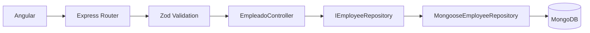

# Práctica 3 - Stack MEAN: Sistema de Gestión de Empleados

Implementación académica de un módulo CRUD de empleados utilizando **MongoDB, Express, Angular, Node.js y TypeScript**, desarrollada para la asignatura **Patrones de Diseño de APIs** de la Universidad Politécnica Salesiana.

**Autor:** Hugo Mauricio Saldarriaga Morales  
**Repositorio:** https://github.com/ImEcuadorian/empleados-mean

## Objetivo

Diseñar e implementar una arquitectura web desacoplada, robusta y escalable utilizando el Stack MEAN sobre TypeScript. La práctica parte de un CRUD tradicional y lo refactoriza aplicando separación de responsabilidades, validación perimetral, respuestas HTTP uniformes, programación reactiva e independencia entre componentes de presentación y lógica de aplicación.

## Retos implementados

### 1. Repository Pattern y desacoplamiento de persistencia

El controlador de Express ya no depende directamente de Mongoose. Se introdujo el contrato `IEmployeeRepository` y una implementación concreta `MongooseEmployeeRepository`.

```text
Controller
   |
   v
IEmployeeRepository
   |
   v
MongooseEmployeeRepository
   |
   v
MongoDB
```

Esto permite sustituir la tecnología de persistencia sin modificar el controlador.

### 2. Validación con Zod y Response Wrapper

Las entradas de la API se validan mediante esquemas declarativos de Zod antes de llegar al controlador. También se implementaron:

- DTOs para creación, actualización y parámetros de ruta.
- Middleware reutilizable de validación.
- `AppError` para errores controlados.
- Middleware global de errores.
- Respuestas HTTP uniformes mediante `ApiResponse<T>`.

Respuesta exitosa:

```json
{
  "success": true,
  "message": "Empleado creado correctamente",
  "data": {
    "id": "...",
    "nombre": "Ana Torres",
    "cargo": "Analista",
    "departamento": "Tecnología",
    "sueldo": 1200
  }
}
```

Respuesta de error:

```json
{
  "success": false,
  "message": "Datos de solicitud inválidos",
  "errors": {}
}
```

### 3. Estado reactivo e inmutabilidad en Angular

`EmpleadoService` centraliza el estado mediante un `BehaviorSubject` privado y expone `empleados$` como `Observable` de solo lectura.

Las mutaciones del estado generan nuevas referencias:

```ts
this.empleadosSubject.next([
  ...current,
  nuevoEmpleado
]);
```

La actualización usa `map()` y la eliminación usa `filter()`, evitando modificar directamente el arreglo existente.

### 4. Smart vs. Dumb Components

La interfaz se divide en componentes con responsabilidades claras:

- `EmpleadoComponent`: Smart Component / orquestador.
- `EmpleadoFormComponent`: componente presentacional que emite `@Output()`.
- `EmpleadoListComponent`: componente presentacional que recibe `@Input()` y emite `@Output()`.
- El Smart Component consume `empleados$` mediante `async pipe`.

```text
EmpleadoService
      |
      v
EmpleadoComponent (Smart)
    /                 \
   v                   v
EmpleadoForm        EmpleadoList
   (Dumb)              (Dumb)
```

## Tecnologías

| Capa | Tecnología |
| --- | --- |
| Backend | Node.js + Express 5 + TypeScript |
| Persistencia | MongoDB + Mongoose 9 |
| Validación | Zod 4 |
| Frontend | Angular 17 + TypeScript |
| Reactividad | RxJS 7 / BehaviorSubject |
| Desarrollo | Morgan, CORS, tsx |
| Control de versiones | Git + GitHub |

## Estructura del proyecto

```text
empleados-mean/
├── backend/
│   └── src/
│       ├── config/
│       ├── controllers/
│       ├── domain/
│       ├── dtos/
│       ├── errors/
│       ├── middlewares/
│       ├── models/
│       ├── repositories/
│       ├── routes/
│       ├── shared/
│       ├── app.ts
│       └── index.ts
└── frontend/
    └── src/app/
        ├── components/
        │   ├── empleado/
        │   ├── empleado-form/
        │   └── empleado-list/
        ├── models/
        └── services/
```

## API REST

Base URL:

```text
http://localhost:3000/api/v1
```

| Método | Endpoint | Descripción |
| --- | --- | --- |
| `GET` | `/empleados` | Consultar todos los empleados |
| `GET` | `/empleados/:id` | Consultar un empleado por ID |
| `POST` | `/empleados` | Registrar un empleado |
| `PUT` | `/empleados/:id` | Actualizar un empleado |
| `DELETE` | `/empleados/:id` | Eliminar un empleado |

Ejemplo de creación:

```json
{
  "nombre": "Ana Torres",
  "cargo": "Analista",
  "departamento": "Tecnología",
  "sueldo": 1200
}
```

## Requisitos

- Node.js LTS 20 o superior.
- npm.
- Angular CLI 16 o superior.
- MongoDB Server, MongoDB Atlas o MongoDB mediante Docker.

## Ejecución

### 1. Clonar el repositorio

```bash
git clone https://github.com/ImEcuadorian/empleados-mean.git
cd empleados-mean
```

### 2. Iniciar MongoDB

Si se utiliza Docker:

```bash
docker run -d \
  --name mongodb \
  -p 27017:27017 \
  -v mongo_data:/data/db \
  mongo:9.0.2
```

El backend utiliza la base:

```text
mongodb://127.0.0.1/usuarios_db
```

### 3. Ejecutar el backend

```bash
cd backend
npm install
npm run dev
```

Servidor:

```text
http://localhost:3000
```

### 4. Ejecutar el frontend

En otra terminal:

```bash
cd frontend
npm install
npm start
```

Aplicación:

```text
http://localhost:4200
```

## Flujo de una solicitud




## Historial principal de refactorización

Los cambios de la práctica fueron organizados en commits independientes:

```text
43a14e4 refactor(backend): decouple employee persistence with repository pattern
1ae8968 feat(backend): add request validation and universal API responses
81a48da refactor(frontend): implement reactive employee state management
c951d7f refactor(frontend): split employee UI into smart and presentational components
```
## Código inicial

- Backend: https://github.com/pmpvhr/code.git
- Frontend: https://github.com/pmpvhr/maestria.git

## Licencia y uso

Proyecto desarrollado con fines académicos para la asignatura **Patrones de Diseño de APIs**.
